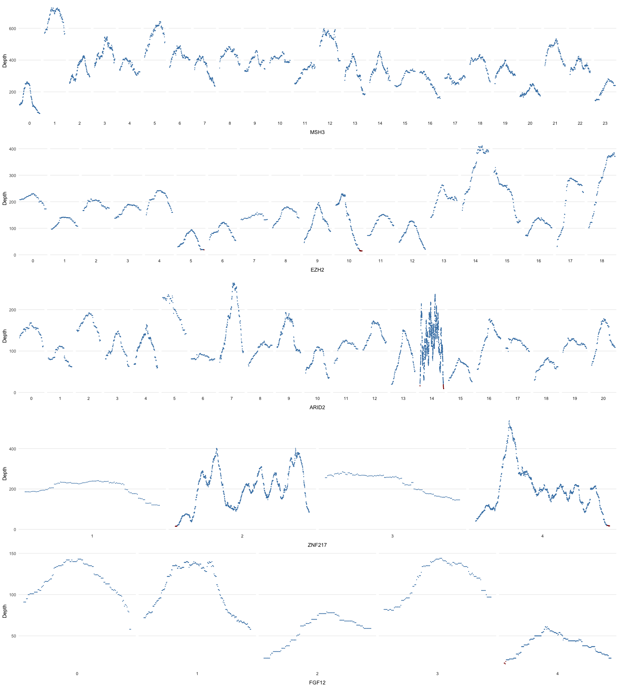
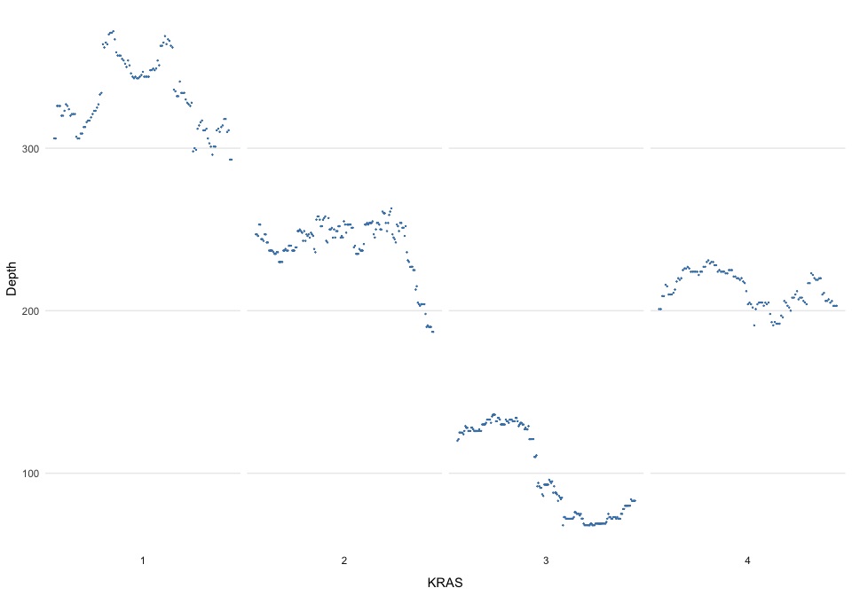
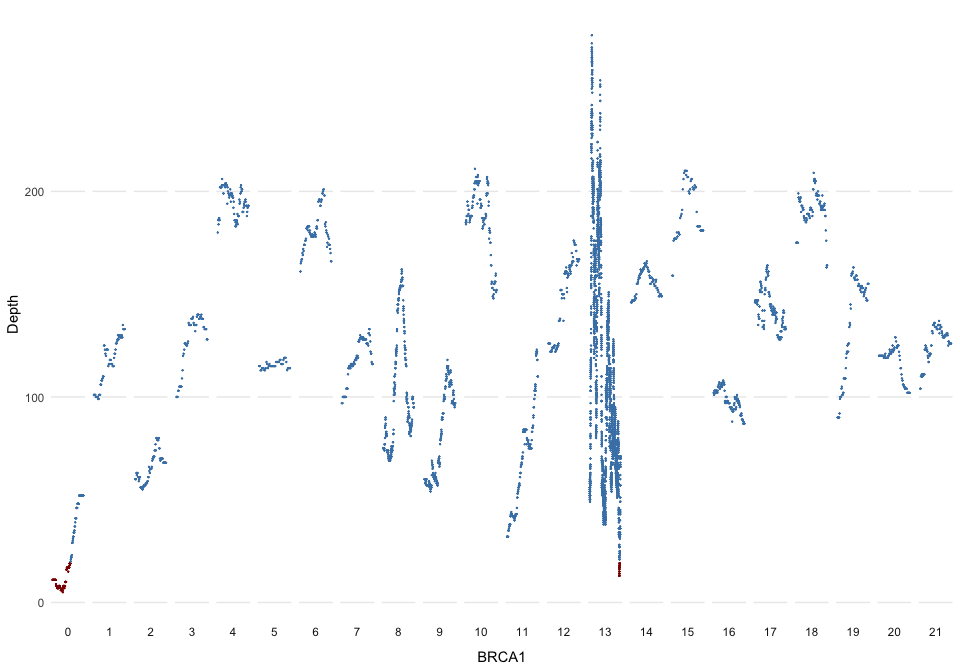

Introduction
------------
We are interested in assessing the depth of read coverage for our TruSeq and 10X
somatic COLO829 WGS samples at exonic regions of a set of cancer genes.
The `az300.bed` file contains 300 such genes of interest for AstraZeneca Oncology.
The following schematic (from
[here](https://bioconductor.org/packages/3.7/bioc/vignettes/annotatr/inst/doc/annotatr-vignette.html))
shows the basic structure of a gene.


There are a ~~few~~ lot of complexities with selecting the proper exon
coordinates for each gene, including (see [link1](https://www.biostars.org/p/16505/),
[link2](https://bioinformatics.stackexchange.com/questions/21/feature-annotation-refseq-vs-ensembl-vs-gencode-whats-the-difference)
for more):

* A gene may have several transcripts, which have different start/end coordinates
  for each exon.
* There is no standard way of representing a gene (HGNC symbol, Ensembl Gene ID,
  Entrez Gene ID?)
* There is not always a one-to-one mapping between Ensembl Gene and Entrez Gene
  IDs.

The basic idea is:

* Get the gene name for each of the az300 genes (so you only need gene name from this)
* Use the GENCODE GTF file to extract the canonical transcripts for the above gene names 
  (so you only need tx ID + gene name from this)
* Use the UCSC Exon BED file to annotate the coverage regions with transcript information 
  (can do straight with mosdepth + bedtools)

Grab only az300 canonical tx IDs from the UCSC BED file: 

```
zfgrep -f az300_tx.pattern gencode_genes_v27lift37_exons_coding_b37.bed.gz
```

Datasets
--------


```r
az300 <- readr::read_tsv("../../nogit/data/ref/az300.bed.gz",
                      col_names = c("chr", "start", "end", "gene_name"),
                      col_types = "ciic")

# for the canonical transcripts <-> gene name mapping
gencode <- readr::read_tsv('../../nogit/data/ref/gencode.v27lift37.basic.annotation.gtf.gz',
                           col_names = c("chrom", "source", "feature", "start",
                                         "end", "score", "strand", "phase", "attribute"),
                           col_types = "ccciicccc",
                           skip = 5) %>% 
  dplyr::select(chrom, start, end, feature, attribute)
```

* Glimpse at datasets:


```r
glimpse(az300) # 300 genes
## Observations: 300
## Variables: 4
## $ chr       <chr> "1", "1", "1", "1", "1", "1", "1", "1", "1", "1", "1...
## $ start     <int> 6241329, 8064464, 9711790, 11166592, 27022524, 40361...
## $ end       <int> 6269449, 8086368, 9789172, 11322564, 27108595, 40367...
## $ gene_name <chr> "RPL22", "ERRFI1", "PIK3CD", "MTOR", "ARID1A", "MYCL...
glimpse(gencode) # 1,651,703
## Observations: 1,651,703
## Variables: 5
## $ chrom     <chr> "chr1", "chr1", "chr1", "chr1", "chr1", "chr1", "chr...
## $ start     <int> 11869, 11869, 11869, 12613, 13221, 12010, 12010, 121...
## $ end       <int> 14409, 14409, 12227, 12721, 14409, 13670, 12057, 122...
## $ feature   <chr> "gene", "transcript", "exon", "exon", "exon", "trans...
## $ attribute <chr> "gene_id \"ENSG00000223972.5_2\"; gene_type \"transc...
```

* Get az canonical transcripts:


```r
az_tx <- gencode %>% 
  filter(feature == "transcript",
         grepl("appris_principal", attribute)) %>%
  mutate(transcript = str_extract(attribute, 'ENST\\d{11}\\.\\d+'),
         gene_name = str_extract(attribute, 'gene_name\\s\\".*?;'),
         size = end - start) %>% 
  separate(gene_name, c('skip', 'gene_name', 'skip2'), '\"') %>%
  select(-c(skip, skip2, feature, attribute)) %>%
  group_by(gene_name) %>%
  top_n(n = 1, wt = size) %>% # top gene by size
  filter(gene_name %in% az300$gene_name)
  # pull(transcript)

glimpse(az_tx) # 297
## Observations: 297
## Variables: 6
## $ chrom      <chr> "chr1", "chr1", "chr1", "chr1", "chr1", "chr1", "ch...
## $ start      <int> 6245080, 8071779, 9711803, 11166592, 27022524, 4036...
## $ end        <int> 6259672, 8086368, 9788977, 11322564, 27108595, 4036...
## $ transcript <chr> "ENST00000234875.8", "ENST00000377482.9", "ENST0000...
## $ gene_name  <chr> "RPL22", "ERRFI1", "PIK3CD", "MTOR", "ARID1A", "MYC...
## $ size       <int> 14592, 14589, 77174, 155972, 86071, 4655, 14923, 10...
```

* Process coverage data:


```r
depth_data <- readr::read_tsv(
  "../../nogit/data/HCC2218/mosdepth/HCC2218_tumor.per-base_exons_coding.bed.gz",
  col_names = c("chromA", "startA", "endA", "depth",
                "chromB", "startB", "endB", "transcript", "score", "strand"),
  col_types = "ciiiciiccc") %>% 
  separate(transcript, c('transcript', 'rest'), sep = '_cds_') %>% 
  separate(rest, c('before', 'stuff'), sep = '_chr') %>% 
  separate(before, c('exon_number', 'num2'), sep = '_') %>% 
  mutate(
    depth_cat = case_when(depth < 20 ~ '< 20 Reads', TRUE ~ '>= 20 Reads'),
    depth_cat = factor(depth_cat, levels = c('< 20 Reads', '>= 20 Reads')),
    transcript = case_when(grepl('_', transcript) ~ gsub('_.', '', transcript), TRUE ~ transcript)) %>% 
  dplyr::select( 
    chr = "chromA", start = "startA", end = "endA",
    transcript, depth, depth_cat, exon_number,
    exon_start = "startB", exon_end = "endB") %>% 
  filter(transcript %in% az_tx$transcript) # keep only az300 tx

saveRDS(depth_data, "../../nogit/data/HCC2218/mosdepth/depth_data_final.rds")
```


```r
dd <- readr::read_rds("../../nogit/data/HCC2218/mosdepth/depth_data_final.rds")
dd <- az_tx %>% 
  select(transcript, gene_name) %>% 
  dplyr::left_join(dd, ., by = "transcript")
  
glimpse(dd) # 433,712 rows
## Observations: 433,712
## Variables: 10
## $ chr         <chr> "1", "1", "1", "1", "1", "1", "1", "1", "1", "1", ...
## $ start       <int> 6246729, 6246732, 6246734, 6246735, 6246736, 62467...
## $ end         <int> 6246732, 6246734, 6246735, 6246736, 6246738, 62467...
## $ transcript  <chr> "ENST00000234875.8", "ENST00000234875.8", "ENST000...
## $ depth       <int> 62, 63, 64, 65, 66, 64, 62, 65, 70, 71, 73, 74, 75...
## $ depth_cat   <fct> >= 20 Reads, >= 20 Reads, >= 20 Reads, >= 20 Reads...
## $ exon_number <chr> "0", "0", "0", "0", "0", "0", "0", "0", "0", "0", ...
## $ exon_start  <int> 6246731, 6246731, 6246731, 6246731, 6246731, 62467...
## $ exon_end    <int> 6246876, 6246876, 6246876, 6246876, 6246876, 62468...
## $ gene_name   <chr> "RPL22", "RPL22", "RPL22", "RPL22", "RPL22", "RPL2...
```


```r
# set a custom color that will work even if a category is missing
scale_colour_custom <- function(...){
  ggplot2:::manual_scale('colour', 
                         values = setNames(c('darkred', 'steelblue'),
                                           c('< 20 Reads','>= 20 Reads')), 
                         ...)
}


plot_maker <- function(tx) {
  num_of_exons <- dd %>%
    filter(transcript == tx) %>%
    pull(exon_number) %>%
    as.numeric() %>%
    max()
  gene_name <- dd %>%
    filter(transcript == tx) %>% 
    pull(gene_name) %>% 
    unique()
  # expand to create a row for each sequence and fill in previous values
  dd %>%
    filter(transcript == tx) %>% 
    group_by(exon_number) %>% 
    expand(start = full_seq(c(start, end), 1)) %>% 
    # create one row per base position, grouped by Exon Number https://stackoverflow.com/questions/42866119/fill-missing-values-in-data-frame-using-dplyr-complete-within-groups
    # fill missing values https://stackoverflow.com/questions/40040834/r-replace-na-with-previous-or-next-value-by-group-using-dplyr
    left_join(., 
              dd %>%  filter(transcript == tx)) %>% 
    fill(chr:gene_name) %>% 
    ungroup() %>% # drop the exon number grouping, so I can mutate below
    mutate(exon_number = factor(exon_number, levels = 0:num_of_exons)) %>% # Ah, reordering. I need it to be a factor, but then I have to explicitly give the order   
    # mutate(depth_cat = factor(depth_cat, levels = c('< 10 Reads','< 20 Reads','>= 20 Reads'))) %>%  # for coloring
    ggplot(aes(x = start, xend = end, y = depth, yend = depth, colour = depth_cat)) + 
    facet_wrap(~exon_number, scales = 'free_x', nrow = 1, strip.position = 'bottom') + 
    geom_point(size = 0.1) + 
    theme_minimal() + 
    scale_colour_custom() +  # use my custom color set above for my three categories
    theme(axis.text.x = element_blank(), 
          axis.ticks.x = element_blank(), 
          panel.grid.minor = element_blank(), 
          panel.grid.major.x = element_blank(),
          legend.position = 'none') + 
    ylab('Depth') + 
    xlab(paste0(gene_name[1]))
}
```


```r
plots <- purrr::map(az_tx$transcript[sample(nrow(az_tx), 5)], plot_maker)
## Joining, by = c("exon_number", "start")
## Joining, by = c("exon_number", "start")
## Joining, by = c("exon_number", "start")
## Joining, by = c("exon_number", "start")
## Joining, by = c("exon_number", "start")
cowplot::plot_grid(plotlist = plots, ncol = 1)
```

<!-- -->


```r
plot_maker("ENST00000256078.8") # KRAS
## Joining, by = c("exon_number", "start")
```

<!-- -->

```r
plot_maker("ENST00000357654.7") # BRCA1
## Joining, by = c("exon_number", "start")
```

<!-- -->
