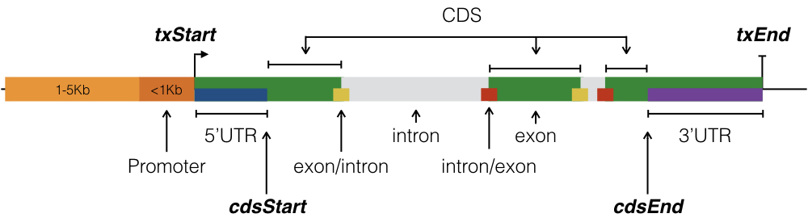

```{r setup, include=FALSE, message=FALSE}
knitr::opts_chunk$set(collapse = TRUE)
require(tidyverse)
require(cowplot)
set.seed(1)
```

Introduction
------------
We are interested in assessing the depth of read coverage for our TruSeq and 10X
somatic COLO829 WGS samples at exonic regions of a set of cancer genes.
The `az300.bed` file contains 300 such genes of interest for AstraZeneca Oncology.
The following schematic (from
[here](https://bioconductor.org/packages/3.7/bioc/vignettes/annotatr/inst/doc/annotatr-vignette.html))
shows the basic structure of a gene.



There are a ~~few~~ lot of complexities with selecting the proper exon
coordinates for each gene, including (see [link1](https://www.biostars.org/p/16505/),
[link2](https://bioinformatics.stackexchange.com/questions/21/feature-annotation-refseq-vs-ensembl-vs-gencode-whats-the-difference)
for more):

* A gene may have several transcripts, which have different start/end coordinates
  for each exon.
* There is no standard way of representing a gene (HGNC symbol, Ensembl Gene ID,
  Entrez Gene ID?)
* There is not always a one-to-one mapping between Ensembl Gene and Entrez Gene
  IDs.

The basic idea is:

* Get the gene name for each of the az300 genes (so you only need gene name from this)
* Use the GENCODE GTF file to extract the canonical transcripts for the above gene names 
  (so you only need tx ID + gene name from this)
* Use the UCSC Exon BED file to annotate the coverage regions with transcript information 
  (can do straight with mosdepth + bedtools)

Grab only az300 canonical tx IDs from the UCSC BED file: 

```
zfgrep -f az300_tx.pattern gencode_genes_v27lift37_exons_coding_b37.bed.gz
```

Datasets
--------

```{r}
cov_fnames <- list.files("../../nogit/data/COLO829", full.names = TRUE) 
aliases <- basename(cov_fnames) %>% 
  as_tibble() %>% 
  mutate(clean = tolower(sub(".per-base.region_az300_canonical_tx.bed.gz", "", value))) %>%
  mutate(clean = sub("colo829", "", clean)) %>%
  mutate(batch = case_when(
    grepl("ema", clean) ~ "EMA",
    grepl("downsample", clean) ~ "Truseq_Down",
    grepl("truseq", clean) ~ "Truseq",
    grepl("bl", clean) ~ "EMA",
    TRUE ~ clean)) %>%
  mutate(pc = sub("_(.*)pc.*", "\\1", clean),
         pc = ifelse(grepl("b", pc), "blood", pc),
         pc = ifelse(grepl("^[-_]", pc), "100", pc)) %>% 
  unite("batch_pc", c("batch", "pc")) %>% 
  pull(batch_pc)

tibble(aliases = aliases, fnames = basename(cov_fnames)) %>% 
  arrange(aliases)
```

```{r func_def}
read_cov <- function(fname, az_tx) {
  
  cov <- readr::read_tsv(fname, 
                         col_names = c("chromA", "startA", "endA", "depth", "chromB", "startB", "endB", "tx"),
                         col_types = "ciidciic") %>% 
    separate(tx, c('tx', 'rest'), sep = '_cds_') %>% 
    separate(rest, c('before', 'stuff'), sep = '_chr') %>% 
    separate(before, c('exon_number', 'num2'), sep = '_') %>% 
    mutate(
      depth_cat = case_when(depth < 20 ~ '< 20 Reads', TRUE ~ '>= 20 Reads'),
      depth_cat = factor(depth_cat, levels = c('< 20 Reads', '>= 20 Reads')),
      tx = case_when(grepl('_', tx) ~ gsub('_.', '', tx), TRUE ~ tx)) %>% 
    select( 
      chr = "chromA", start = "startA", end = "endA",
      tx, depth, depth_cat, exon_number,
      exon_start = "startB", exon_end = "endB")
  
  az_tx %>% 
    select(tx = transcript, gene_name) %>% 
    left_join(cov, ., by = "tx") %>% 
    select(gene_name, tx, everything())
  
}
```

```{r read_files}
az_tx <- readRDS("../../nogit/data/ref/az300_tx2gene.rds")
cov1 <- read_cov(cov_fnames[1], az_tx) # EMA_100
cov2 <- read_cov(cov_fnames[17], az_tx) # Truseq_100
cov3 <- read_cov(cov_fnames[16], az_tx) # Truseq_down_100
```


```{r glimpse_data}
glimpse(az_tx) # 297 tx
glimpse(cov1)
glimpse(cov2)
glimpse(cov3)
cov_all <- dplyr::bind_rows(list(ema100 = cov1, tru100 = cov2, trudown100 = cov3), .id = "sample")
```


```{r plot_maker1}
# set a custom color that will work even if a category is missing
scale_colour_custom <- function(...) {
  ggplot2:::manual_scale('colour', 
                         values = setNames(c('darkred', 'steelblue'),
                                           c('< 20 Reads','>= 20 Reads')), 
                         ...)
}


plot_prep <- function(transcript, cov) {
  num_of_exons <- cov %>%
    filter(tx == transcript) %>%
    pull(exon_number) %>%
    as.numeric() %>%
    max()
  gene_name <- cov %>%
    filter(tx == transcript) %>% 
    pull(gene_name) %>% 
    unique()
  # expand to create a row for each sequence and fill in previous values
  p <- cov %>%
    filter(tx == transcript) %>% 
    group_by(sample, exon_number) %>% 
    expand(start = full_seq(c(start, end), 1)) %>% 
    left_join(., 
              cov %>%  
                filter(tx == transcript)) %>% 
    fill(gene_name:exon_end) %>% 
    ungroup() %>%
    mutate(exon_number = factor(exon_number, levels = 0:num_of_exons))
  
  p
}

plot_prep("ENST00000256078.8", cov_all) %>%
# plot_prep("ENST00000357654.7", cov_all) %>% 
  ggplot(aes(x = start, xend = end, y = depth, yend = depth, colour = sample)) + 
  geom_point(size = 0.1) + 
  geom_line() +
  theme_minimal() + 
  # scale_colour_custom() +  # use my custom color set above for my three categories
  scale_y_continuous(limits = c(0, NA)) +
  theme(axis.text.x = element_blank(), 
        axis.ticks.x = element_blank(), 
        panel.grid.minor = element_blank(), 
        panel.grid.major.x = element_blank()
        # legend.position = 'none'
        ) + 
  facet_wrap(~exon_number, 
             scales = 'free_x', 
             nrow = 1, strip.position = 'bottom') +
  # facet_grid(sample ~ exon_number, scales = 'free_x') +
  ylab('Depth') + 
  # xlab('BRCA1')
  xlab('KRAS')

```

```{r plot_all2, fig.height=20, fig.width=18}
plots <- purrr::map(az_tx$transcript[sample(nrow(az_tx), 5)], plot_maker)
cowplot::plot_grid(plotlist = plots, ncol = 1)
```

```{r plot_single, fig.height=7, fig.width=10}
plot_maker("ENST00000256078.8") # KRAS
plot_maker("ENST00000357654.7") # BRCA1
