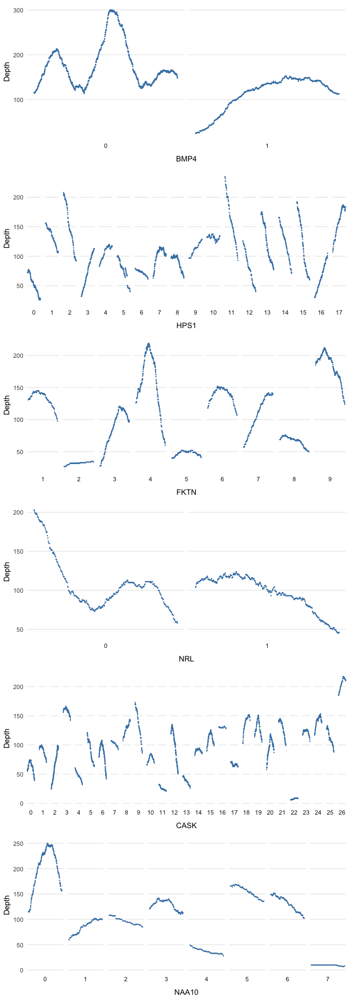

Here I'm playing with the example from:
http://davemcg.github.io/post/let-s-plot-3-base-pair-resolution-ngs-exome-coverage-plots-part-1


<!-- vim-markdown-toc GFM -->

* [Read in data](#read-in-data)
* [Bases per gene](#bases-per-gene)
* [Exons per gene](#exons-per-gene)
* [Coverage per base](#coverage-per-base)
* [Coverage per gene](#coverage-per-gene)
* [Density Plots](#density-plots)
    * [One facet per gene](#one-facet-per-gene)
    * [One facet per exon for each gene](#one-facet-per-exon-for-each-gene)
    * [Multiple genes + exons in grid](#multiple-genes--exons-in-grid)

<!-- vim-markdown-toc -->

## Read in data
* We have 1 base position per row


```r
# 249,911 rows
dd_class <- readr::read_csv("../../data/nogit/dd_class.csv", col_types = "cidciiciic")
glimpse(dd_class)
## Observations: 249,911
## Variables: 10
## $ Transcript  <chr> "ENST00000020945.3", "ENST00000020945.3", "ENST000...
## $ Exon_Number <int> 0, 0, 0, 0, 0, 0, 0, 0, 0, 0, 0, 0, 0, 0, 0, 0, 0,...
## $ Start       <dbl> 49831356, 49831357, 49831358, 49831359, 49831360, ...
## $ Chr         <chr> "8", "8", "8", "8", "8", "8", "8", "8", "8", "8", ...
## $ End         <int> 49831367, 49831367, 49831367, 49831367, 49831367, ...
## $ Read_Depth  <int> 108, 108, 108, 108, 108, 108, 108, 108, 108, 108, ...
## $ Strand      <chr> "-", "-", "-", "-", "-", "-", "-", "-", "-", "-", ...
## $ ExonStart   <int> 49831365, 49831365, 49831365, 49831365, 49831365, ...
## $ ExonEnd     <int> 49831547, 49831547, 49831547, 49831547, 49831547, ...
## $ Name        <chr> "SNAI2", "SNAI2", "SNAI2", "SNAI2", "SNAI2", "SNAI...
```

## Bases per gene


```r
# Chromosomes
table(dd_class$Chr, useNA = "ifany")
## 
##     1    10    11    12    13    14    15    16    17    18    19     2 
## 30812 17350 12176 15339  6328 17315 13739  2803  7140  1034  2941 23254 
##    20    22     3     4     5     6     7     8     9     X 
##  2431  4467 13996 19976  1594  8281  5375 13598 10318 19644
# Genes - 118 total
(gene_count <- dd_class %>%
  group_by(Name) %>% 
  summarise(Count = n()) %>% 
  arrange(-Count))
## # A tibble: 118 x 2
##    Name    Count
##    <chr>   <int>
##  1 LYST    11400
##  2 CHD7     8984
##  3 TENM3    8097
##  4 CEP290   7456
##  5 ABCA4    6804
##  6 CACNA1F  5919
##  7 MYO5A    5514
##  8 LAMB2    5406
##  9 BCOR     5160
## 10 RIMS1    5083
## # ... with 108 more rows
```

## Exons per gene 

* Take one gene first. CEP290 had most exons (53).


```r
dd_class %>%
  select(Name, Exon_Number, Chr) %>%
  filter(Name == "CEP290") %>%
  group_by(Exon_Number) %>%
  summarise(Count = n())
## # A tibble: 53 x 2
##    Exon_Number Count
##          <int> <int>
##  1           0   240
##  2           1    79
##  3           2    95
##  4           3    76
##  5           4   152
##  6           5   173
##  7           6   123
##  8           7   163
##  9           8    87
## 10           9   133
## # ... with 43 more rows
```

* Look at all gene exon numbers in decreasing order:


```r
dd_class %>% 
  select(Name, Exon_Number) %>% 
  unique() %>%
  group_by(Name) %>% 
  summarise(Count = n()) %>% 
  arrange(-Count)
## # A tibble: 118 x 2
##    Name     Count
##    <chr>    <int>
##  1 CEP290      53
##  2 COL4A1      52
##  3 LYST        51
##  4 ABCA4       50
##  5 CACNA1F     48
##  6 MYO5A       41
##  7 CACNA2D4    38
##  8 CHD7        37
##  9 RAB3GAP2    35
## 10 RIMS1       34
## # ... with 108 more rows
```

## Coverage per base


```r
depth1 <- dd_class %>% 
  filter(Name == "ABCA4") %>% 
  pull(Read_Depth)

# Number of bases with depth of coverage > C in Gene A
summary(depth1)
##    Min. 1st Qu.  Median    Mean 3rd Qu.    Max. 
##     8.0    83.0   110.0   120.5   151.0   288.0
sum(depth1 > 5)
## [1] 6804
sum(depth1 > 100)
## [1] 3937
```

## Coverage per gene


```r
dd_class %>% 
  group_by(Name) %>% 
  summarise(
    tot_bases = n(),
    lt5 = sum(Read_Depth < 5),
    lt10 = sum(Read_Depth < 10),
    lt50 = sum(Read_Depth < 50),
    gt10 = sum(Read_Depth >= 10),
    pc5 = lt5 / tot_bases,
    pc10 = lt10 / tot_bases) %>% 
  arrange(-pc10)
## # A tibble: 118 x 8
##    Name    tot_bases   lt5  lt10  lt50  gt10     pc5    pc10
##    <chr>       <int> <int> <int> <int> <int>   <dbl>   <dbl>
##  1 BBIP1         220     0    61   173   159 0       0.277  
##  2 ISPD         1339     0    57   459  1282 0       0.0426 
##  3 CASK         2778     0    79   386  2699 0       0.0284 
##  4 NAA10         725     0    10    87   715 0       0.0138 
##  5 CNGB3        2436     0    18   431  2418 0       0.00739
##  6 LYST        11400    13    66  1024 11334 0.00114 0.00579
##  7 PROM1        2601     0     8   418  2593 0       0.00308
##  8 RET          3348     0     9   252  3339 0       0.00269
##  9 CEP290       7456     0    18  2263  7438 0       0.00241
## 10 SLC25A1       933     0     2   172   931 0       0.00214
## # ... with 108 more rows
```

## Density Plots

### One facet per gene


```r
# Sample X genes
genes <- sample(gene_count$Name, 6)
dd_class %>% 
  filter(Name %in% genes) %>% 
  ggplot(aes(x = Read_Depth)) +
  geom_density(fill = "steelblue") +
  facet_wrap(~Name, ncol = 2) 
```

<!-- -->

### One facet per exon for each gene


```r
dd_class %>%
  filter(Name == genes[1]) %>% 
  ggplot(aes(x = Start, y = Read_Depth)) +
  geom_point(size = 0.1, colour = "steelblue") +
  theme_minimal() +
  theme(axis.text.x = element_blank(),
        panel.grid.minor = element_blank(),
        panel.grid.major.x = element_blank()) +
  facet_wrap(~Exon_Number, nrow = 1, scales = "free_x", strip.position = "bottom") +
  ylab("Depth") +
  xlab("Exon Number")
```

<!-- -->

### Multiple genes + exons in grid


```r
plot_maker <- function(gene){
  
  n_exons <- dd_class %>%
    filter(Name == gene) %>%
    pull(Exon_Number) %>%
    as.numeric() %>% max()
  
  dd_class %>% filter(Name == gene) %>%
    mutate(Exon_Number = factor(Exon_Number, levels = 0:n_exons)) %>%  
    ggplot(aes(x = Start, y = Read_Depth)) + 
    geom_point(size = 0.1, colour = "steelblue") +
    theme_minimal() +
    theme(axis.text.x = element_blank(), 
          axis.ticks.x = element_blank(), 
          panel.grid.minor = element_blank(), 
          panel.grid.major.x = element_blank(),
          legend.position = 'none') + 
    facet_wrap(~Exon_Number, scales = 'free_x', nrow = 1, strip.position = 'bottom') + 
    ylab('Depth') + 
    xlab(gene)
}
```


```r
cowplot::plot_grid(plotlist = purrr::map(genes, plot_maker), ncol = 1)
```

<!-- -->
